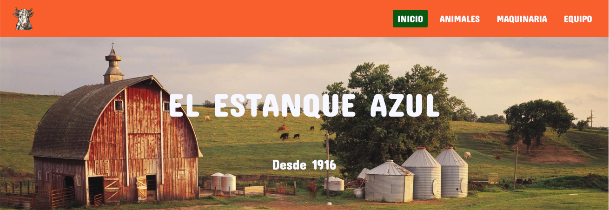

# El Estanque Azul

## Sobre el proyecto
Este es el proyecto final de la primera evaluación. Se pedia una página bonita, comercial y que aplicase ciertos criterios (**responsive, flexbox, grid, menu hamburguesa**...).

## ¿Por qué una granja?
El profesor nos dio a elegir el tema que nosotros quisieramos, ya que el consideraba que ibamos a aprender mas así que si nos daba el ya la idea. Hacía tiempo ya había echo un trabajo de clase para automatizar una granja, por lo que no dude en crear la página de esta granja. Su nombre, **"El Estanque Azul"**, fue generado y escogido de entre muchos.
